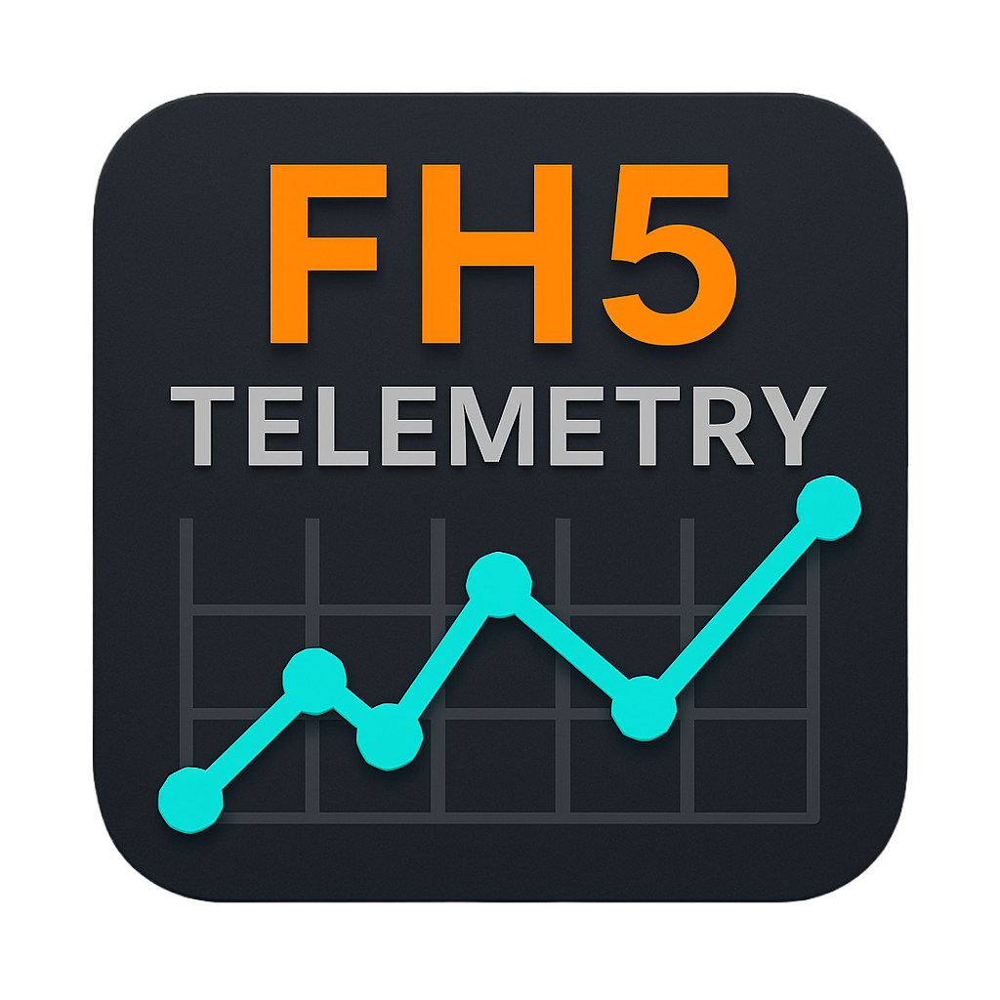
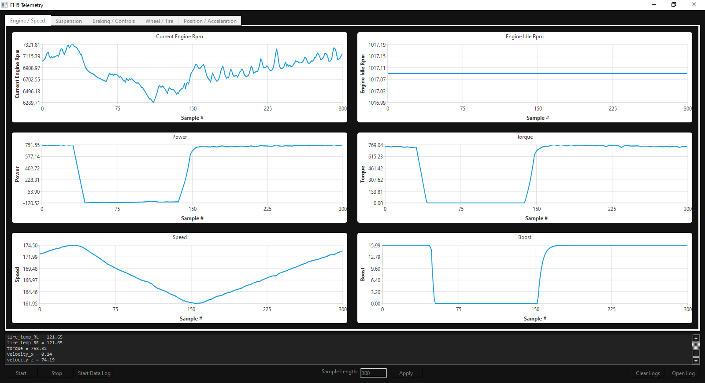
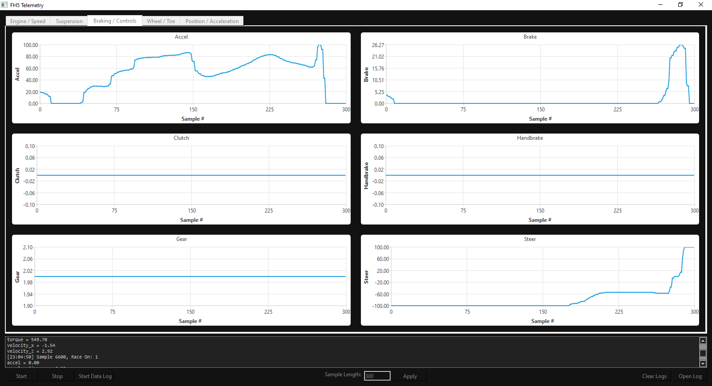
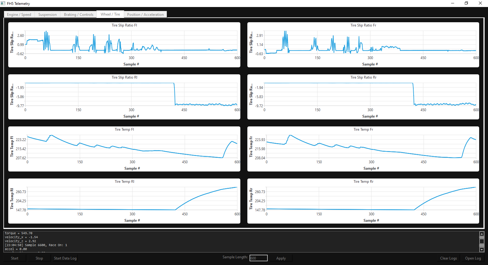

<p align="center">
  
</p>

<h1 align="center">FH5 Telemetry</h1>

<p align="center">
  View and analyze <strong>Forza Horizon 5</strong> telemetry data in real-time.<br>
  Use interactive graphs to fine tune your vehicle.
</p>

## 🧩 Features

- 📡 **UDP Listener**: Captures raw data from FH5 over port `5607`.
- 📊 **Live Graphs**: Real-time charts for engine, suspension, input, etc.
- 💾 **CSV Logging**: Save sessions to file for playback and later review.
- ⏪ **Replay Mode**: Open saved CSV files to view logged data with graph control.
- 🔧 **User Controls**: Adjustable sample count, start/stop, open/clear logs, etc.

## 📷 Preview

<p align="center">
  <br>
  <br>
  
</p>

## 🚗 How It Works

- FH5 sends telemetry packets over UDP (if enabled in the game's settings).
- This app listens for those packets on **port 5607** and parses the raw binary.
- Data is mapped into readable values (speed, throttle, suspension, input, etc.).
- Graphs are updated 12.5x/sec (80ms intervals) with incoming data.
- You can start/stop data logging to CSV for later analysis.
- Use “Open Log” to load logged data and replay it with graph controls.

## 🧑‍💻 Production

### Download & Compile

```bash
git clone https://github.com/svxy/FH5-Telemetry.git
cd fh5-telemetry
pip install -r requirements.txt
python main.py
```

### Or Use the Executable

> Download the `.exe` from the [Releases](https://github.com/svxy/FH5-Telemetry/releases/download/v1.0.0.5/FH5%20Telemetry.exe) page.

1. Launch FH5 and enable telemetry over port `5607`
2. Open **FH5 Telemetry**
3. Click **Start** to begin live monitoring
4. Toggle **Start Data Log** to begin saving to CSV
5. Click **Stop** to safely halt the session
6. Use **Open Log** to load a saved `.csv` and view the replay

## 💡 Tips

- Adjust sample length in the center at the bottom.
- You can visualize up to 8 telemetry streams per tab.
- Charts auto-scale and update live unless paused.
- You can clear logs with the "Clear Logs" button at the bottom.

## 🛠 Requirements

| Tool     | Version |
|----------|---------|
| Python   | 3.12+   |
| PySide6  | 6.8.2.1+  |
| auto-py-to-exe | 2.46.0+ |
| pyinstaller | 6.15.0+ |

To compile:

```bash
pip install auto-py-to-exe
auto-py-to-exe
```

- Use **one file**, **window based**, and **include icon (optional)**.

## 👀 Credits

- Original core UDP listener by [Jasperan](https://github.com/jasperan/forza-horizon-5-telemetry-listener)
- UI concept inspired by **Snap-on Verus Edge** diagnostic interface

## 📄 License

This project is licensed under the **MIT License** - do whatever you want, just don't sue me.

See [`LICENSE`](./LICENSE) for full details.

## 🚀 Coming Soon

- Torque conversion (not entirely accurate right now)
- Fix for speed, suspension, and velocity charts (jittering at idle/standstill)
- Input to choose port?
- UI Improvements